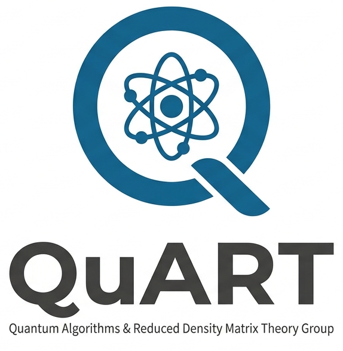

- **Q**uantum **A**lgorithms and **R**dm **T**heory **LAB**oratory

- **Q**uantum **ART**ificial **LAB**oratory

Bienvenido!

Esta es la página del grupo de investigación del Dr. Juan Felipe Huan Lew Yee.

Nos dedicamos a hacer:

- Química Cuántica

- Machine Learning

- Quantum Computing

**Ubicación:** Facultad de Química, Universidad Nacional Autónoma de México

{fig-align="center" width="80%"}